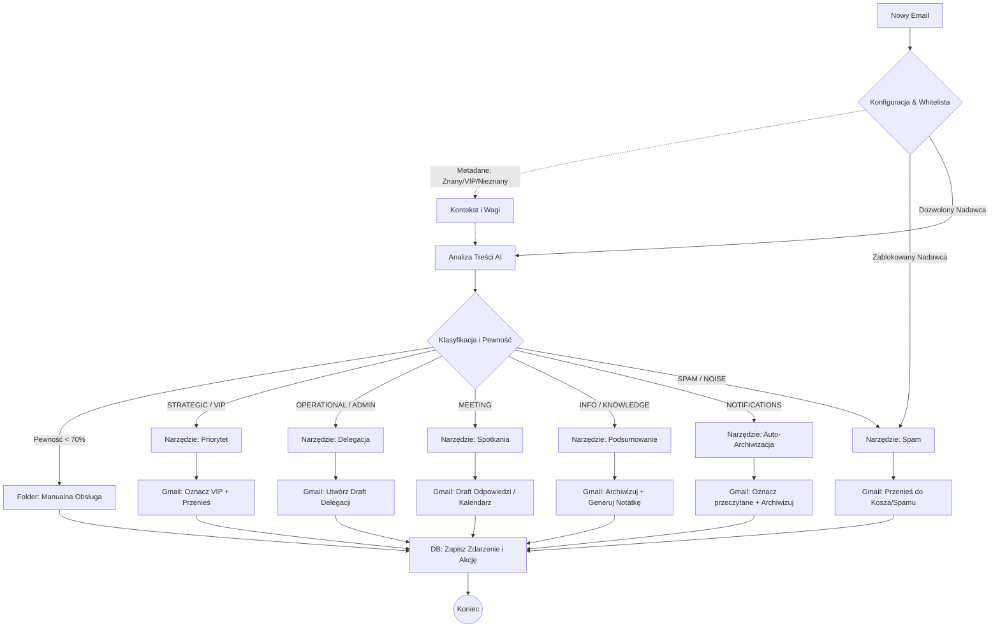

//// https://gemini.google.com/app/dd14c77affc9a8e5?hl=pl

# Analiza Biznesowa Modułu: Triage Orchestrator

**Wersja:** 1.1 (Po doprecyzowaniu przepływu i narzędzi)
**Status:** Zatwierdzony do implementacji MVP
**Cel Biznesowy:** "Focus Leverage" – Odciążenie Executive'a z decyzji "co zrobić z tym mailem" poprzez automatyczną klasyfikację i przygotowanie wstępnej pracy (Drafty/Segregacja), redukując czas obsługi skrzynki o min. 80%.

## 1. Architektura Logiczna Modułu (Mermaid)

Diagram przedstawia zaktualizowany przepływ, w którym każdy niezablokowany e-mail jest analizowany przez AI (z uwzględnieniem wag z whitelisty), a wszystkie akcje są logowane.

## 2. Szczegółowy Opis Funkcjonalności i Narzędzi

### F1: Kategoryzacja Wspierana Wagami (Context-Aware AI)

**Opis:** System nie stosuje "ślepego" FastTracka. Zamiast tego, status nadawcy (np. "Jest na Whiteliście") jest przekazywany do AI jako silna waga (podpowiedź).
- Jeśli nadawca jest VIP, AI ma obniżony próg dla kategorii STRATEGIC (łatwiej wpaść do priorytetów).
- Jeśli nadawca jest Nieznany, AI stosuje domyślne, ostrzejsze kryteria.
- Tylko nadawcy z "Czarnej Listy" trafiają bezpośrednio do Narzędzia Spam z pominięciem AI.

### F2: Zestaw Narzędzi (Tools Registry)

Każde narzędzie jest autonomicznym modułem wykonującym specyficzną logikę biznesową:

**Narzędzie: Priorytet (Strategic/VIP)**
- **Cel:** Natychmiastowa ekspozycja wiadomości.
- **Akcja:** Przeniesienie do folderu "Priorytety", oznaczenie gwiazdką, ewentualne oflagowanie dla powiadomień push (przez inny moduł).
- **Output:** E-mail w folderze VIP, wpis w DB.

**Narzędzie: Delegacja (Operational/Admin)**
- **Cel:** Przygotowanie zadania dla zespołu/księgowości.
- **Akcja:** Analiza treści -> Wybór delegata -> Przygotowanie Draftu w Gmailu z instrukcją dla pracownika.
- **Output:** Draft w Gmailu ("Do: Anna, Temat: Fwd: Faktura..."), wpis w DB.

**Narzędzie: Spotkania (Meeting)**
- **Cel:** Obsługa zaproszeń i konfliktów.
- **Akcja (MVP):** Wykrycie prośby o spotkanie -> Sprawdzenie konfliktu (opcjonalnie) -> Przygotowanie Draftu odpowiedzi (np. "Dziękuję, proponuję termin X" lub "Proszę o kontakt z asystentką").
- **Output:** Draft w Gmailu, wpis w DB.

**Narzędzie: Podsumowanie (Info/Knowledge)**
- **Cel:** Kondensacja wiedzy bez zajmowania czasu.
- **Akcja:** Wygenerowanie 3-zdaniowego podsumowania (przez AI) -> Zapisanie podsumowania w bazie -> Archiwizacja maila.
- **Output:** Oryginał w archiwum, "pigułka wiedzy" w bazie danych (do raportu).

**Narzędzie: Auto-Archiwizacja (Notifications)**
- **Cel:** Usuwanie szumu systemowego.
- **Akcja:** Oznacz jako przeczytane -> Archiwizuj.
- **Output:** Czysty Inbox, log w DB ("Otrzymano 5 powiadomień Jira").

**Narzędzie: Spam (Noise/Spam)**
- **Cel:** Eliminacja zagrożeń i śmieci.
- **Akcja:** Przeniesienie do folderu Spam lub Kosza.
- **Output:** Log w DB (dla statystyk skuteczności filtrowania).

### F3: Mechanizm "Confidence Threshold" (Bezpiecznik)

**Opis:** Jeśli AI nie jest pewne kategorii (pewność < 70%), system przenosi e-mail do folderu "Manualna Obsługa" z etykietą ❓ AI Unsure.
**Logowanie:** Nawet ten przypadek jest logowany do DB jako "Manual Review Needed", co pozwala monitorować jakość modelu.

### F4: Centralne Logowanie (DB Action Log)

**Opis:** Każde narzędzie kończy pracę sygnałem do modułu bazy danych.
**Cel:** Zbudowanie pełnej historii zdarzeń ("Audit Trail") dla modułu Raportowania/Powiadomień. Dzięki temu moduł powiadomień nie musi pytać Gmaila, co się stało – czyta to bezpośrednio z naszej bazy.

## 3. Lista Wymagań Technicznych (Dla Modułu Triage)

- **Obsługa Wag w Prompcie:** Prompt do LLM musi przyjmować parametry dynamiczne: sender_status (VIP/Unknown/Team) oraz previous_interactions (jeśli dostępne), aby sterować "skłonnością" AI do pewnych kategorii.
- **Atomowość Logiczna:** Operacja na Gmailu i wpis do DB powinny być traktowane spójnie (np. w bloku try-catch). Jeśli API Gmaila zwróci błąd, nie logujemy sukcesu w DB.
- **Tryb "Cichego Spamu":** Narzędzie Spam musi działać dyskretnie, ale zostawiać ślad w bazie, aby w razie "False Positive" użytkownik mógł zobaczyć w raporcie: "Zablokowano: Ważna Oferta (pomyłka)".

## 4. Rekomendacje Rozwojowe (Phase 2)

- **Smart Meeting Negotiation:** Rozbudowa Narzędzia Spotkań o automatyczne sprawdzanie kalendarza i proponowanie tylko wolnych slotów w drafcie.
- **One-Click Feedback:** Dodanie w drafcie delegacji ukrytego linku/przycisku, który po kliknięciu przez Executive'a (np. "Źle dobrany delegat") wysyła sygnał zwrotny do systemu uczenia.