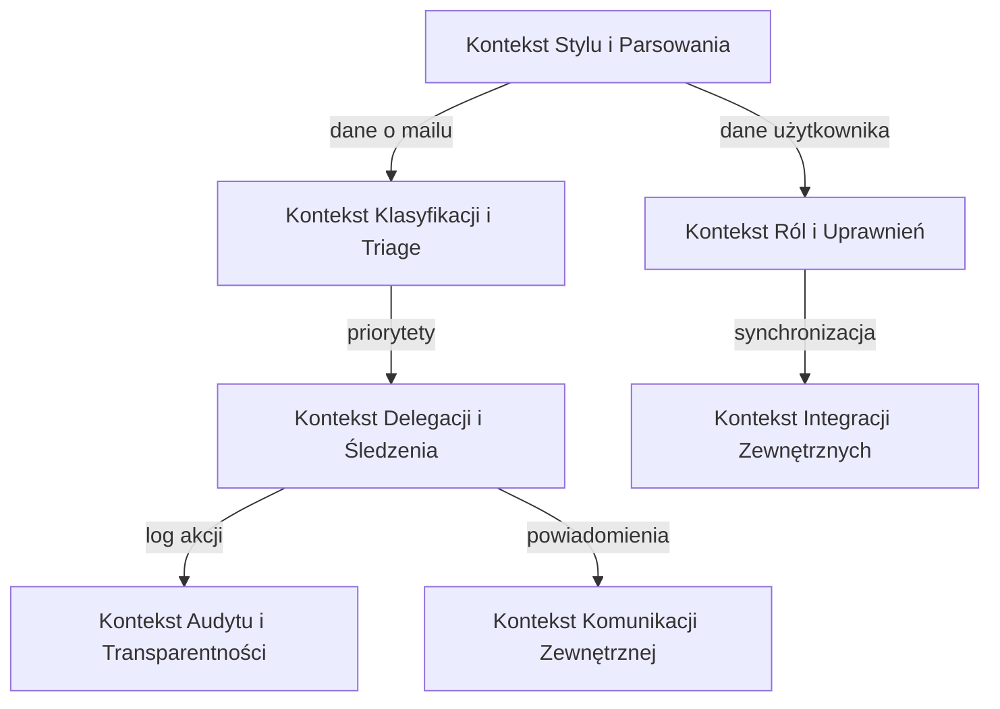

Świetnie — poniżej znajdziesz kompletną **analizę strategiczną DDD** w języku polskim, obejmującą wszystkie wymagane elementy: klasyfikację poddomen, identyfikację kontekstów, mapowanie relacji między nimi oraz wzorce integracji.
Analiza dotyczy systemu **Executive Email Automation (MVP)**.

---

## 1. Klasyfikacja Poddomen (Subdomain Classification)

| **Poddomena**                          | **Opis**                                                                        | **Klasyfikacja**         | **Uzasadnienie Biznesowe**                                                                                                            | **Złożoność** | **Zmienność** | **Priorytet** |
| :------------------------------------- | :------------------------------------------------------------------------------ | :----------------------- | :------------------------------------------------------------------------------------------------------------------------------------ | :------------ | :------------ | :------------ |
| **Analiza Stylu i Parsowanie Emaili**  | Analiza historii wiadomości, wykrywanie stylu i tonu odpowiedzi właściciela.    | **Core Subdomain**       | Kluczowa przewaga konkurencyjna – system uczy się „stylu prezesa”, co zapewnia autentyczność odpowiedzi i eliminuje robotyczny ton.   | Wysoka        | Średnia       | Wysoki        |
| **Klasyfikacja i Triage Emaili**       | Kategoryzacja wiadomości według nadawcy, ważności, relacji.                     | **Core Subdomain**       | Krytyczny element wartości dla użytkownika – zapewnia selekcję i priorytetyzację, dzięki czemu menedżer nie przeoczy istotnych maili. | Wysoka        | Średnia       | Wysoki        |
| **Delegacja i Śledzenie Zadań**        | Zamiana maili w zadania, przypomnienia o braku odpowiedzi, obsługa follow-upów. | **Core Subdomain**       | Kluczowa dla zapewnienia „zamkniętej pętli” (Closed Loop) – zwiększa odpowiedzialność i efektywność zespołu.                          | Wysoka        | Średnia       | Wysoki        |
| **Zarządzanie Powiadomieniami**        | Sterowanie godzinami działania automatyzacji, powiadomienia i podsumowania.     | **Supporting Subdomain** | Niezbędne operacyjnie, ale nie stanowi przewagi – można zbudować wewnętrznie lub później standaryzować.                               | Średnia       | Niska         | Średni        |
| **Audyt i Transparentność**            | Pełny zapis działań systemu (audit trail), wyjaśnienie decyzji automatu.        | **Core Subdomain**       | Zaufanie to fundament przy pracy z wrażliwą pocztą – bez ścieżki audytu system traci wiarygodność.                                    | Wysoka        | Średnia       | Wysoki        |
| **Zarządzanie Użytkownikami i Rolami** | Zarządzanie kontami, uprawnieniami, trybem „on behalf of”.                      | **Supporting Subdomain** | Standardowa funkcjonalność niebędąca źródłem przewagi – konieczna dla bezpieczeństwa i konfiguracji.                                  | Średnia       | Niska         | Średni        |
| **Integracje Zewnętrzne**              | Połączenie z kalendarzem, HR, Active Directory.                                 | **Supporting Subdomain** | Rozszerzenie wartości systemu, ale nie kluczowe w MVP.                                                                                | Średnia       | Średnia       | Niski         |
| **Komunikacja Zewnętrzna**             | Wysyłanie powiadomień przez zewnętrzne kanały (np. WhatsApp, Teams).            | **Generic Subdomain**    | Można użyć gotowych rozwiązań/API – nie ma potrzeby tworzyć od zera.                                                                  | Niska         | Niska         | Niski         |

---

## 2. Identyfikacja Bounded Contexts

| **Nazwa Kontekstu**                    | **Granice Odpowiedzialności**                                                         | **Język Ubiquitarny (Ubiquitous Language)**             | **Odpowiedzialności**                                                                                        | **Powiązane Poddomeny**            | **Autonomia** |
| :------------------------------------- | :------------------------------------------------------------------------------------ | :------------------------------------------------------ | :----------------------------------------------------------------------------------------------------------- | :--------------------------------- | :------------ |
| **Kontekst Stylu i Parsowania**        | Odpowiada za analizę wzorców językowych i generowanie odpowiedzi w stylu użytkownika. | Ton, Styl, Szablon, Personalizacja, Kontekst Odpowiedzi | Analizuje maile, generuje sugestie odpowiedzi w „głosie” użytkownika.                                        | Analiza Stylu i Parsowanie Emaili  | Wysoka        |
| **Kontekst Klasyfikacji i Triage**     | Klasyfikacja wiadomości przychodzących, identyfikacja ważnych nadawców.               | Triage, P0, P1, Priorytet, Nadawca, Reguła, Szum        | Przypisuje priorytety mailom na podstawie relacji i reguł użytkownika.                                       | Klasyfikacja i Triage Emaili       | Wysoka        |
| **Kontekst Delegacji i Śledzenia**     | Przekształcanie maili w zadania i ich śledzenie do momentu zakończenia.               | Zadanie, Delegacja, Follow-up, Przypomnienie, Status    | Zarządza cyklem życia zadań, przypomnieniami i regułami agresywności śledzenia.                              | Delegacja i Śledzenie Zadań        | Średnia       |
| **Kontekst Audytu i Transparentności** | Zapis i raportowanie wszystkich akcji systemu.                                        | Log, Audyt, Ścieżka, Akcja, Reguła, Powód               | Gromadzi dane o działaniach (np. kto, kiedy, na jakiej podstawie) dla zapewnienia zaufania i rozliczalności. | Audyt i Transparentność            | Średnia       |
| **Kontekst Ról i Uprawnień**           | Zarządza użytkownikami, rolami, uprawnieniami i relacjami delegacyjnymi.              | Użytkownik, Rola, Delegacja, Uprawnienie, On-Behalf-Of  | Odpowiada za kontrolę dostępu i konfigurację relacji pomiędzy EA a Prezesem.                                 | Zarządzanie Użytkownikami i Rolami | Średnia       |
| **Kontekst Integracji Zewnętrznych**   | Połączenia z kalendarzem, HR, Active Directory.                                       | Integracja, Synchronizacja, API, Konto                  | Zapewnia synchronizację danych o użytkownikach i zdarzeniach z systemami zewnętrznymi.                       | Integracje Zewnętrzne              | Niska         |
| **Kontekst Komunikacji Zewnętrznej**   | Wysyłanie powiadomień i podsumowań przez kanały zewnętrzne.                           | Powiadomienie, Digest, Kanał, Wiadomość                 | Zapewnia dostarczanie informacji z innych kontekstów (np. przypomnienia, raporty).                           | Komunikacja Zewnętrzna             | Niska         |

---

## 3. Mapowanie Kontekstów (Context Mapping)

### Diagram (Mermaid)

---

### Opis Relacji i Wzorce DDD

| **Relacja**                          | **Typ Relacji DDD**                    | **Opis i Uzasadnienie**                                            | **Implikacje Techniczne / Organizacyjne**           | **Ryzyka**                                  |
| :----------------------------------- | :------------------------------------- | :----------------------------------------------------------------- | :-------------------------------------------------- | :------------------------------------------ |
| Styl i Parsowanie → Klasyfikacja     | **Customer–Supplier**                  | Parsing dostarcza dane o stylu i strukturze maila do klasyfikacji. | Silne powiązanie danych, potrzeba kontraktu API.    | Błędna klasyfikacja przy niepełnych danych. |
| Klasyfikacja → Delegacja             | **Customer–Supplier**                  | Wynik triage inicjuje zadania w kontekście delegacji.              | Kolejność asynchroniczna, wymaga spójności zdarzeń. | Opóźnienia w przepływie, duplikaty zadań.   |
| Delegacja → Audyt                    | **Customer–Supplier**                  | Każda akcja w delegacji zapisywana w audycie.                      | Architektura event-driven (logowanie zdarzeń).      | Utrata zaufania przy błędnym logu.          |
| Delegacja → Komunikacja Zewnętrzna   | **Open Host Service**                  | Powiadomienia wysyłane do różnych kanałów.                         | Interfejs REST/Webhook.                             | Błędy w integracji lub limitach API.        |
| Ról i Uprawnień ↔ Styl i Parsowanie | **Shared Kernel**                      | Współdzielą dane o użytkownikach i konfiguracjach.                 | Wymaga synchronizacji modeli.                       | Ryzyko konfliktów modelu.                   |
| Ról i Uprawnień ↔ Integracje        | **Shared Kernel / Published Language** | Wspólny model użytkownika zewnętrznego (np. AD).                   | Wspólna definicja kontraktu API.                    | Zależność od systemów zewnętrznych.         |

---

## 4. Wzorce Integracji (Integration Patterns)

| **Połączenie**                | **Tryb**     | **Wzorzec**            | **Konsekwencje dla Spójności Danych**                      | **Kluczowe Zdarzenia Domenowe**            |
| :---------------------------- | :----------- | :--------------------- | :--------------------------------------------------------- | :----------------------------------------- |
| Styl → Klasyfikacja           | Synchronous  | Request–Response       | Wysoka spójność danych w czasie rzeczywistym.              | `EmailParsed`                              |
| Klasyfikacja → Delegacja      | Asynchronous | Event-Driven           | Eventual consistency, większa skalowalność.                | `EmailClassified`, `ImportantMailDetected` |
| Delegacja → Audyt             | Asynchronous | Event-Driven           | Logi mogą się pojawiać z opóźnieniem, ale nie mogą zginąć. | `TaskDelegated`, `FollowUpTriggered`       |
| Delegacja → Komunikacja       | Asynchronous | Event-Driven / Webhook | Elastyczna integracja z różnymi kanałami.                  | `NotificationRequested`, `ReminderSent`    |
| Ról i Uprawnień ↔ Integracje | Synchronous  | Request–Response       | Silna spójność z danymi zewnętrznymi.                      | `UserRoleSynced`                           |

---

## 5. Kluczowe Decyzje i Rekomendacje Architektoniczne

> 💡 **Największy problem domenowy**: **Zaufanie i Transparentność**
> (czyli pytanie: „co system zrobił z moim mailem i dlaczego?”)

### Sposób rozwiązania:

- Wprowadzenie **kontekstu Audytu** jako niezależnego komponentu z event storem.
- Każde działanie (triage, delegacja, powiadomienie) generuje **zdarzenie domenowe** zapisywane w audycie.
- Interfejs użytkownika udostępnia „**ścieżkę decyzji**” – widoczny powód, reguła, data i wykonawca.
- Architektura **event-driven (CQRS + Event Sourcing)** zapewnia spójność historyczną i pełną rekonstruowalność decyzji.

---

## 6. Wnioski Strategiczne (dla fazy DDD Tactical)

1. **Kontekst Klasyfikacji i Delegacji** to serce systemu – powinien być rozwijany przez **główny zespół domenowy**.
2. **Audyt i Transparentność** wymaga silnego oddzielenia (oddzielny bounded context, osobna baza).
3. **Komunikacja zewnętrzna** i **Integracje** mogą być realizowane przez zespół pomocniczy lub outsourcing.
4. **Modele domenowe** dla ról i uprawnień powinny być wspólne w Shared Kernel, z wyraźnymi kontraktami integracyjnymi.
5. **Event-driven integracja** jest zalecana – umożliwia asynchroniczność i rozdzielenie odpowiedzialności.

---

### Podsumowanie

- **Core Domain**: Triage, Styl i Delegacja – tu powstaje unikalna wartość biznesowa.
- **Supporting**: Uprawnienia, Powiadomienia, Integracje – potrzebne do działania, ale nie strategiczne.
- **Generic**: Komunikacja zewnętrzna – można oprzeć na gotowych rozwiązaniach.

➡️ **Architektura strategiczna powinna być zorganizowana wokół trzech głównych kontekstów domenowych:**
**(1)** Klasyfikacja, **(2)** Delegacja, **(3)** Audyt – z jasnym przepływem zdarzeń i odpowiedzialności.
